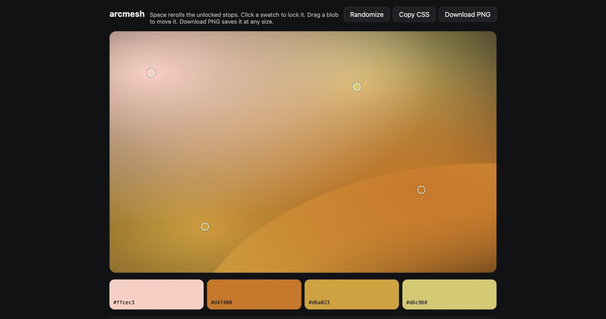

# arcmesh

A mesh gradient generator whose Randomize button picks a palette, not a seed.

Live at [arcmesh.aebauer.dev](https://arcmesh.aebauer.dev). Press Space.

[](https://arcmesh.aebauer.dev)

## Why

Mesh gradient tools usually make you pick the colors, which is the hard part. Their randomize buttons reshuffle positions and leave the colors alone, or sample hues independently and produce grey smears where far-apart hues blend.

arcmesh picks hues on one arc of the color wheel, 30 to 90 degrees wide, assigns lightness along a ramp so every mesh has a bright region and a deep region, drops the darkest stop further on some palettes for depth, and lets an occasional accent sit split-complementary to the arc, at reduced chroma and in the brightest slot, so it reads as a highlight rather than blending to grey. Everything happens in OKLCH, where equal numeric steps read as equal visual steps, and every color is clamped into the sRGB gamut by binary search on chroma rather than by clipping channels.

Some palettes carry a crease, the fold a real mesh gradient makes: a hard curved edge on one side of a color region, soft on the others. Each crease is one more radial gradient, an ellipse of the stop's color centered off the canvas with a hard stop at its edge, painted below the blobs so their soft falloffs veil it, so it is still plain CSS.

A faint grain sits over everything: an SVG tile of fractal noise blended soft-light at 8 percent, which hides banding in the long fades and makes the mesh read as printed rather than computed. It is one more `background-image` layer, a data URI, so the copied CSS still stands alone.

The preview is a stack of CSS radial-gradients applied through a style element, and the copied CSS is that same string. What you see is what you paste.

## Use

Space or the Randomize button rerolls every unlocked stop, creases included. Click a swatch to lock it, and its crease stays with it. Drag a blob to move it. Copy CSS copies the declarations. Download PNG renders the same layers to a canvas at a preset or custom size, up to 8192 pixels a side. The URL hash holds the whole palette, so a link reproduces it.

## Run

```sh
npm install
npm run dev
npm test
npm run build
```

Requires Node 22 or newer. On npm 11, `npm install` warns that it skipped esbuild's postinstall script; the build works without it.

No backend, no environment variables, no accounts. It deploys as a static site.

## Layout

`src/palette` is the engine: a seeded generator, the OKLCH math, the harmony rules, and the URL codec. It imports nothing from React or the DOM and is tested directly, including a property test that generates a thousand palettes and guards that every color is in gamut and every palette honors the arc rule.

`src/render/layers.ts` describes a palette as one ordered list of radial-gradient layers; `src/render/css.ts` emits that list as CSS and `src/render/canvas.ts` draws it to a canvas for the PNG, so the preview and the download cannot drift apart. `src/render/grain.ts` holds the noise tile for both. The one residual is the browser's own: on a wide-gamut display Chrome composites CSS layers in the display's color space and the canvas composites in sRGB, so saturated overlaps in the preview can sit a few levels away from the PNG. `src/components` and `src/App.tsx` are the React shell.

The OKLCH to sRGB conversion is written out rather than imported. It is about sixty lines, uses the standard Ottosson coefficients, and is tested against published values for the sRGB primaries.

## License

MIT
